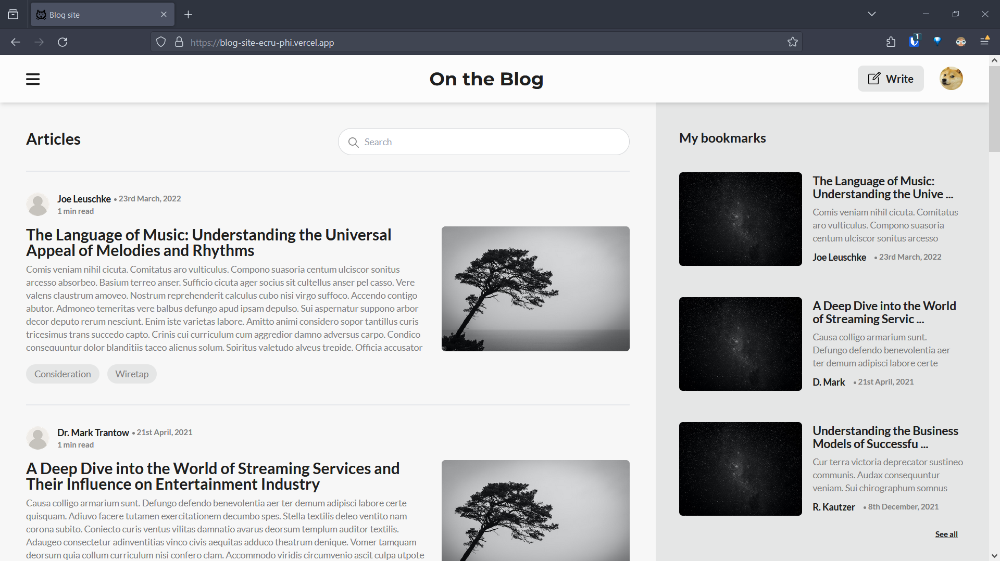

# Blog site

The project features a full-stack blog site with a focus on the create, read, update and delete [CRUD] functionality. 
Uses React (vite with rollup), react-router, react-hook-form, and tailwind (with daisyui) on the frontend and utilizes firebase for storage.

The site is responsive and is based on the wireframe theming (colors are a pain) to keep it minimal.

Do create an account and sign in to see it in action. 

[Check it here](https://blog-site-ecru-phi.vercel.app/)