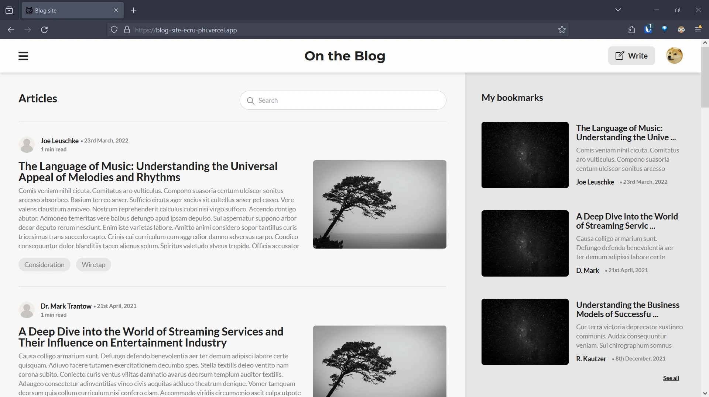

# Blog site




The project features a full-stack blog site with a focus on the create, read, update and delete [CRUD] functionality. 

Uses React (vite with rollup), react-router, react-hook-form, and tailwind (with daisyui) on the frontend and utilizes firebase for storage.
The site is responsive and is based on the wireframe theming (colors are a pain) to keep it minimal.


### Features

- Create an account
- Create and Delete articles
- Edit articles
- Bookmark articles
- Edit profile


### Sample account 

For a test. Sign in with these credentials to see all the above features in action.
```
username: cheems@doge.com
password: cheemsthedoge
```

### Deployment

[Check it here](https://blog-site-ecru-phi.vercel.app/)